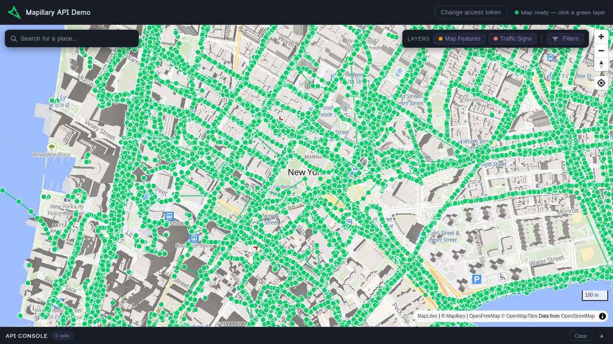

# Mapillary API Demo

A comprehensive, interactive demo of the [Mapillary](https://www.mapillary.com/) API — built entirely through **vibecoding** with [Manus](https://manus.im). No frameworks, no build step: just vanilla HTML, CSS, and JavaScript.

**[Live Demo](https://github.com/mapillary/api-demo)**



---

## What This Demonstrates

This single-page application showcases many of the core capabilities of the Mapillary platform in one place, making it useful as a reference implementation or starting point for developers working with the Mapillary API.

### Mapillary API Features

| Feature | API Endpoint / Source | Description |
|---|---|---|
| **Image Tiles** | `tiles.mapillary.com/maps/vtp/mly1_public/2/{z}/{x}/{y}` | Vector tile layer showing image coverage as green sequences and points |
| **Map Feature Points** | `tiles.mapillary.com/maps/vtp/mly_map_feature_point/2/{z}/{x}/{y}` | Toggleable layer displaying detected map features (fire hydrants, benches, etc.) |
| **Traffic Sign Tiles** | `tiles.mapillary.com/maps/vtp/mly_map_feature_traffic_sign/2/{z}/{x}/{y}` | Toggleable layer displaying detected traffic signs |
| **Image Metadata** | `GET graph.mapillary.com/{image_id}` | Retrieves full image metadata including coordinates, camera parameters, capture date, and creator |
| **Image Detections** | `GET graph.mapillary.com/{image_id}/detections` | Lists all object detections for an image with classification values |
| **Sequence Browsing** | `GET graph.mapillary.com/image_ids?sequence_id=...` | Fetches all images in a sequence for navigation |
| **Street-Level Viewer** | MapillaryJS 4 | Full 360° and perspective image viewer with spatial navigation |
| **Tile Filtering** | Vector tile URL parameters | Date range, panorama-only, and username filters applied directly to tile requests |

### Application Features

The app itself includes a number of UI and interaction features beyond the raw API calls.

**Map and Navigation** — The left panel renders an interactive map powered by MapLibre GL JS with OpenFreeMap tiles as the base layer. Mapillary coverage appears as green sequences and image dots. A geocoder search bar (using the Nominatim API) lets you fly to any location. Clicking on a green sequence or image dot opens the corresponding street-level image.

**Street-Level Viewer** — The right panel hosts a MapillaryJS 4 viewer with full spatial navigation. A tab bar provides access to four views: the viewer itself, image metadata, object detections, and sequence information. An attribution bar shows the image creator and capture date.

**Layer Toggles and Filters** — A toolbar above the map provides toggles for Map Features and Traffic Signs layers. A Filters panel with flatpickr date pickers lets you constrain the visible coverage by date range or limit to 360° panoramas only. Active filters are indicated by a green outline on the Filters button.

**API Console** — A collapsible drawer at the bottom of the screen logs every API call made by the application in real time, showing the HTTP method, endpoint, status code, response time, and full JSON response body. This makes it easy to understand exactly what the app is doing under the hood.

**Resizable Panels** — A draggable divider between the map and viewer panels lets you adjust the layout to your preference.

---

## Getting Started

### Use the Live Demo

Visit **[https://github.com/mapillary/api-demo](https://github.com/mapillary/api-demo)** — the app loads with a default access token and is ready to use immediately.

### Run Locally

Clone the repo and open `docs/index.html` in a browser, or serve it with any static file server:

```bash
git clone https://github.com/mapillary/api-demo.git
cd api-demo/docs
python3 -m http.server 8000
```

Then open [http://localhost:8000](http://localhost:8000).

### Use Your Own Access Token

Click **"Change access token"** in the header to enter your own Mapillary API token. You can obtain one from the [Mapillary Developer Portal](https://www.mapillary.com/developer).

---

## Tech Stack

This project uses **zero build tools** and **no frameworks**. Everything runs directly in the browser.

| Component | Version | Purpose |
|---|---|---|
| Vanilla JavaScript | ES2020+ | Application logic |
| [MapLibre GL JS](https://maplibre.org/) | 4.7.1 | Interactive map rendering |
| [MapillaryJS](https://mapillary.github.io/mapillary-js/) | 4.1.2 | Street-level image viewer |
| [Flatpickr](https://flatpickr.js.org/) | Latest | Date picker for filters |
| [OpenFreeMap](https://openfreemap.org/) | — | Base map tiles |
| [Nominatim](https://nominatim.org/) | — | Geocoding search |

---

## How This Was Built

This entire application was **vibecoded** using [Manus](https://manus.im) — an AI agent that can build complete software projects through natural language conversation. The app was developed iteratively across multiple prompts, starting from a basic map + viewer layout and progressively adding features like the geocoder, layer toggles, filters, detection tabs, API console, and various UX refinements.

No code was written by hand. Every line of HTML, CSS, and JavaScript was generated by Manus based on conversational instructions.

---

## Attribution Requirements

- If you are downloading individual images and serving them from your own servers, you must attribute the image(s) by visibly displaying and linking back to the Mapillary homepage or corresponding Mapillary image page.
- If you integrate data that Mapillary extracts from street-level images using the Mapillary API or our vector tiles in your application, you must attribute the source of the data by visibly displaying and linking back to the Mapillary homepage.

---

## License

MIT
